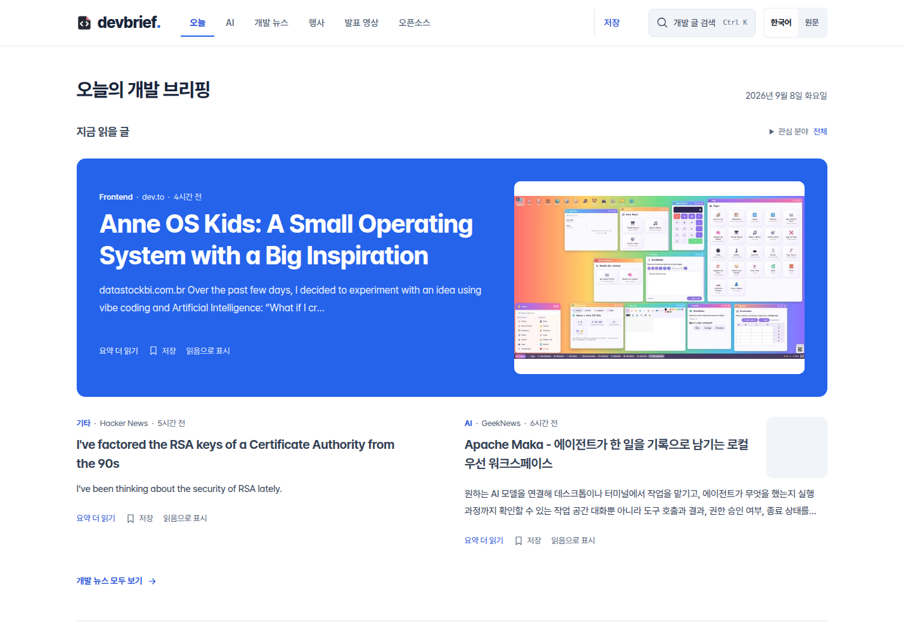
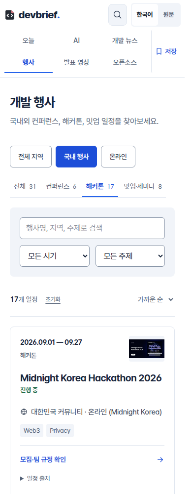
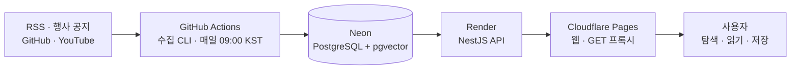

# Devbrief

개발 뉴스, 발표 영상, 오픈소스와 국내외 행사를 모아 **읽을 정보와 참여할 기회를 찾는 기술 큐레이션 서비스**입니다.

[서비스 보기](https://devbrief.pages.dev) · [행사 탐색](https://devbrief.pages.dev/conferences) · [설계 사례](#설계와-문제-해결) · [로컬 실행](#로컬-실행)

[](https://github.com/wooinwoo/devbrief/actions/workflows/ci.yml)



> 2026-09-08 배포 후보 화면입니다. 실제 운영 API를 연결한 로컬 Cloudflare Pages 빌드에서 촬영했습니다. 웹 공개 배포본과 화면이 다를 수 있습니다.

## 어떤 문제를 풀었나요?

기술 블로그, GitHub, 발표 영상과 행사 공지를 따로 확인하다 보면 정보 수집에 시간을 쓰고도 읽을 글이나 참가할 행사를 고르기 어렵습니다. Devbrief는 **탐색, 읽기 선택, 저장**을 한 흐름으로 연결합니다.

프로젝트 범위는 웹 UI, NestJS API, 수집 파이프라인, DB와 배포입니다. 특히 수집량을 늘리는 과정에서 드러난 날짜 오류·국내 행사 누락·중복 저장을 해결하고, 실패를 추적할 수 있는 운영 구조를 만드는 데 집중했습니다.

## 주요 경험

| 화면 | 사용자가 할 수 있는 일 |
| --- | --- |
| 오늘 | 관심 분야에 맞는 최근 미열람 글을 최대 3편 골라 요약을 확인하고 읽거나 저장합니다. |
| 개발 뉴스·AI | 글을 검색하고 출처·분야·읽음 상태로 좁힙니다. 전체 글 검색은 서버 검색 API를 사용합니다. |
| 행사 | 컨퍼런스·해커톤·밋업을 구분하고, 국내·온라인·시기·주제로 걸러 공식 참가 안내를 확인합니다. |
| 발표 영상·오픈소스 | 제목·채널·주제로 영상을 찾고, 일간·주간 GitHub 트렌딩과 원본 저장소를 탐색합니다. |
| 저장한 글 | 북마크를 검색·정렬하고 읽음 상태를 관리합니다. 기록은 브라우저에 보관합니다. |

<details>
<summary>모바일 행사 화면</summary>



위와 같은 배포 후보와 운영 API를 사용한 화면입니다.

</details>

## 설계와 문제 해결

### 1. 행사 수집량보다 날짜와 분류의 정확성을 먼저 검증했습니다

해외 중심 피드만으로는 국내 행사가 충분히 수집되지 않았습니다. AWSKRUG, Dev Korea, GDG Incheon의 공개 일정을 추가하고, 피드가 없는 주최자의 공식 공지는 별도 확인 목록으로 보완했습니다.

- 외부 피드와 AI 추출 결과에 같은 날짜·URL 검증을 적용합니다. 접수 마감일을 개최일로 사용하지 않고, 종료된 일정과 잘못된 달력 날짜를 제외합니다.
- URL과 정규화한 행사명·개최일을 기준으로 중복을 제거합니다. 기존 승인·거절 상태는 수집 때문에 바뀌지 않습니다.
- 단순 밋업과 실제 해커톤을 구분합니다. 같은 URL에서는 공식 공지로 확인한 정보가 축약된 피드보다 먼저 저장됩니다.
- 신규 행사는 기본적으로 `PROPOSED` 상태입니다. 공식 일정과 참가 조건을 검토한 뒤 공개합니다.

2026-09-08에는 운영 DB를 백업하고 국내 행사 **27개를 추가·공개**했습니다. 기존 895개 중 오류 시드 3개만 정정하고 **나머지 892개는 모든 필드를 보존**했습니다. 같은 입력을 다시 수집했을 때 신규 저장은 **0개**였습니다.

[수집·운영 반영 기록](docs/event-collection.md) · [공통 검증 경계](apps/api/src/conferences/event-candidate.ts) · [공식 공지 확인 목록](apps/api/src/conferences/verified-korean-events.ts)

### 2. 수집 작업과 사용자 요청을 분리했습니다

현재 운영은 GitHub Actions의 `collect` 명령이 매일 09:00 KST에 실행되도록 구성했습니다. CLI가 DB에 직접 저장하므로 수집을 위해 HTTP 서버나 Redis 워커를 계속 실행할 필요가 없습니다. Render API는 저장된 데이터를 웹에 제공합니다.

수집처 하나가 실패해도 다른 수집 단계는 계속 진행합니다. 실패는 로그와 종료 코드로 전달하며, Actions의 `tee` 뒤에서도 실패가 성공으로 표시되지 않도록 검증했습니다. Gemini 키가 없는 현재 운영에서는 공개 메타데이터, 추출식 요약과 규칙 기반 브리핑을 사용합니다.

[수집 워크플로](.github/workflows/ingest.yml) · [CLI의 단계별 실패 처리](apps/api/src/cli.ts) · [데이터 복구 사례](docs/deployment-audit-2026-09-07.md)

### 3. 화면 안에서 끝나는 상태 변경에 서버 탐색을 사용하지 않았습니다

이미 받은 목록의 탭·필터 변경에도 서버 페이지를 다시 요청하던 흐름을 정리했습니다. URL은 History API로 갱신하고 현재 데이터를 재사용합니다. 새로고침과 링크 공유에 필요한 검색 조건은 URL에 남깁니다.

배포 후보의 Chromium 검사에서 **탭 전환 4회와 글 검색 1회 동안 추가 루트 RSC 요청 0건**을 확인했습니다. 이 수치는 초기 로딩이나 운영 API의 콜드 스타트 개선율을 뜻하지 않습니다.

관심 분야 브리핑은 최근 7일의 불러온 글 중 미열람 글을 고르고 출처를 분산합니다. 별도 추천 모델이나 AI 호출 없이 기존 요약과 읽음 기록을 활용합니다. 저장한 글은 ID 배치 조회로 불러옵니다.

[네트워크 검사 결과](docs/portfolio-checks.json) · [URL 상태 처리](apps/web/src/lib/use-url-filter.ts) · [관심 분야 브리핑 설계](docs/case-personal-reading.md)

### 4. 선택형 AI 기능의 근거와 실패 경로를 구현했습니다

Gemini 요약·768차원 임베딩, pgvector 검색과 SSE 답변을 사용하는 관리자용 RAG도 구현했습니다. 검색 출처를 답변보다 먼저 전달하고, 빈 검색 결과에서는 답변 생성을 요청하지 않습니다. 잘못된 차원·0 벡터·비정상 숫자는 DB 조회·저장 전에 거절합니다.

이 경로는 테스트 대역으로 출처 연결과 실패 분기를 검증했습니다. **현재 공개 운영에서는 AI·임베딩 생성과 관리자 챗봇을 활성화하지 않았습니다.** 실제 검색 정확도와 답변 품질을 측정한 결과로 제시하지 않습니다.

[RAG 출처 연결과 실패 처리](docs/case-rag-evidence.md) · [벡터 검증과 저장](apps/api/src/embedding/embedding.service.ts)

## 운영 구조



| 영역 | 기술과 선택 |
| --- | --- |
| 웹 | Next.js 16, React 19, Tailwind CSS 4. Cloudflare Pages 빌드는 vinext 어댑터를 사용합니다. |
| API·데이터 | NestJS 11, TypeScript, Prisma, PostgreSQL, pgvector |
| 수집 | `rss-parser`, `cheerio`, 공개 JSON·HTML·iCalendar 피드, YouTube 공개 RSS |
| 운영·검증 | pnpm workspace, GitHub Actions, Biome, Jest, Vitest·Testing Library |
| 선택 구성 | Gemini, Redis·BullMQ 워커와 서버 Cron. 현재 운영 배치와는 별도의 실행 경로입니다. |

웹은 수동 Pages 배포이고 API는 GitHub의 `master`와 연결돼 있습니다. Redis를 활성화한 서버 Cron과 Actions를 함께 실행하면 수집이 중복 실행되므로 운영에서는 한 경로를 선택합니다. [배포 가이드](docs/cloudflare-pages.md)

## 검증 결과

2026-09-08, 코드 커밋 [`48ac163`](https://github.com/wooinwoo/devbrief/commit/48ac1630bda6aa559273d9478786f7322998dc5f) 기준입니다. 데이터 건수는 사용자 수나 트래픽 지표가 아닙니다.

| 검증 | 확인 결과 |
| --- | --- |
| API 회귀 테스트 | 44개 파일, 469개 통과 |
| 웹 회귀 테스트 | 48개 파일, 394개 통과 |
| CI | 타입 검사·린트·API/웹 테스트·빌드 통과. [실행 기록](https://github.com/wooinwoo/devbrief/actions/runs/34191766832) |
| 실제 운영 API | 진행 중·예정 행사 915개, 국내 31개, 국내 해커톤 17개. 신규 공개 27개 모두 조회 확인 |
| 데이터 보존 | 기존 해외·지역 미분류 예정 행사 884개 모두 유지 |
| 브라우저 | 운영 API를 연결한 Pages 빌드에서 행사 탭·독립 페이지를 320/390/768/1440px로 검사. 가로 넘침·실행 오류 없음 |

세부 실행 범위와 제한은 [검증 기록](docs/portfolio-checks.json)에 남겼습니다. 자동 테스트 수만으로 운영 품질이나 모든 브라우저 호환성을 보장하지는 않습니다.

## 로컬 실행

아래 명령은 Node.js **24**, Corepack, Docker Compose 기준입니다. 아래는 AI 키와 Redis 없이 공개 데이터 수집부터 확인하는 구성입니다.

```sh
git clone https://github.com/wooinwoo/devbrief.git
cd devbrief
corepack pnpm install --frozen-lockfile
docker compose up -d postgres
cp apps/api/.env.example apps/api/.env
cp packages/db/.env.example packages/db/.env
```

`apps/api/.env`의 `REDIS_URL`, `GEMINI_API_KEY`, `YOUTUBE_API_KEY`를 **빈 값**으로 바꿉니다. 예시의 `AIza...`는 실제 키가 아닙니다. 두 환경 파일의 `DATABASE_URL`은 같은 로컬 DB를 가리켜야 합니다. 기본 예시는 Compose의 DB 설정과 일치합니다.

```sh
corepack pnpm db:generate
corepack pnpm db:migrate:deploy
corepack pnpm --filter @devbrief/api build
corepack pnpm dev
```

웹은 `http://localhost:3000`, API는 `http://localhost:4000/api/v1`입니다. 개발 서버의 초기 소스 등록이 끝난 뒤 다른 터미널에서 첫 수집을 실행합니다. `--filter ... exec`를 사용해 API 디렉터리의 `.env`를 읽습니다.

```sh
corepack pnpm --filter @devbrief/api exec node dist/cli.js collect
# 행사 수집만 실행
corepack pnpm --filter @devbrief/api exec node dist/cli.js conferences
```

새 행사는 검토 대기로 저장됩니다. 관리자 사용 시 API의 `ADMIN_API_TOKEN`과 웹의 동일 토큰, `ADMIN_PASSWORD`, `ADMIN_SESSION_SECRET`을 설정합니다. 웹 환경변수는 `apps/web/.env.local`에 두며 토큰에 `NEXT_PUBLIC_` 접두사를 붙이지 않습니다. 설정 전 관리자 쓰기 요청은 거부됩니다.

Redis 워커를 확인하려면 Compose의 `redis` 서비스와 `REDIS_URL`을 활성화합니다. AI 요약·임베딩·RAG는 유효한 Gemini 키와 별도 처리가 필요합니다. [환경·배포 설정](DEPLOY.md)

```sh
corepack pnpm typecheck
corepack pnpm lint
corepack pnpm --filter @devbrief/api test --runInBand
corepack pnpm --filter @devbrief/web test --maxWorkers=2
corepack pnpm build
corepack pnpm --filter @devbrief/web build:pages
```

## 한계와 다음 개선

- 공식 공지 확인 목록은 사람이 갱신합니다. 국내 행사를 전부 자동 발견하는 시스템은 아니며 참가 자격·접수 가능 여부는 주최자 안내를 확인해야 합니다.
- 외부 피드·비공식 번역·HTML 구조가 바뀌면 수집이 실패할 수 있습니다. 소스별 실패를 추적하고 기존 데이터를 보존합니다.
- 관심 분야·북마크·읽음은 브라우저 저장소를 사용하므로 기기 간 동기화되지 않습니다. 추천 범위도 화면에서 불러온 기사에 한정됩니다.
- 행사 API는 최대 1,000개를 반환합니다. 더 커지면 서버 페이지네이션이 필요합니다. Render의 콜드 스타트도 남아 있습니다.
- 실제 사용자 재방문율, 읽기 시간 절약, RAG 검색 정확도와 실기기 Safari 호환성은 별도 검증이 필요합니다.

## 코드와 문서 탐색

```text
apps/web           사용자 화면 · 관리자 화면 · 서버 프록시
apps/api           API · 수집 CLI · 선택형 AI/큐/스케줄러
packages/db        Prisma 스키마 · 마이그레이션
packages/shared    공유 TypeScript 타입
docs               설계 사례 · 수집 근거 · 배포/검증 기록
```

- [관심 분야 브리핑](docs/case-personal-reading.md): 선정 기준, 읽음·저장 흐름, 검증 한계
- [RAG 근거 연결](docs/case-rag-evidence.md): SSE 출처 순서, 벡터 검증, 장애 처리
- [행사 수집](docs/event-collection.md): 수집처, 일정 검증, 중복 방지, 운영 반영
- [운영 DB 복구](docs/deployment-audit-2026-09-07.md): 백업, 누락 마이그레이션, 데이터 보존
- [Cloudflare Pages](docs/cloudflare-pages.md): 빌드·배포·환경변수·복구 방법

개인 포트폴리오의 비상업적 사용을 전제로 합니다. 행사 데이터의 출처·라이선스와 변경 내용은 [수집 문서](docs/event-collection.md)에 명시하며, 각 화면에서 원문 링크를 제공합니다.
