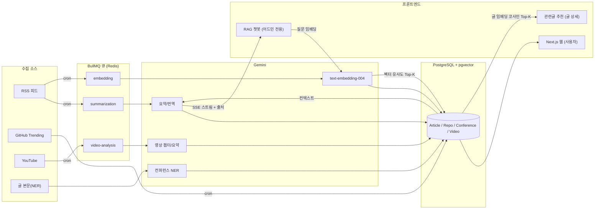

# Devbrief

> 매일 쏟아지는 기술 정보를 한 곳에서. 자동으로 모으고, AI가 한국어로 요약한다.

RSS 글, 컨퍼런스, GitHub 트렌딩, 발표 영상을 자동 수집해 한국어로 요약하는
개인용 기술 큐레이션 도구입니다. 수집한 글은 pgvector로 임베딩해 두며,
이 임베딩을 활용한 RAG 챗봇은 운영 비용 때문에 어드민 전용 도구로 제공합니다.

[](https://github.com/wooinwoo/devbrief/actions/workflows/ci.yml)


## 이런 문제를 풀었습니다

개발자와 PM은 매일 RSS 리더, 기술 블로그, GitHub 트렌딩, 컨퍼런스 영상을 따로따로 확인합니다.
정보는 넘치는데 제목만 훑고 대부분 놓칩니다. 기존 도구는 각각 한계가 있습니다.

- RSS 리더는 원문을 그대로 쌓아둘 뿐 정리해 주지 않습니다.
- 텍스트 다이제스트 메일은 검색도 인터랙션도 안 됩니다.
- 범용 챗봇은 한국 소스에 약하고, 내가 어떤 글을 봤는지 모릅니다.

Devbrief는 여러 소스를 한 파이프라인으로 모아 **자동 수집 → AI 한국어 요약 → 의미 임베딩**까지
한 곳에서 처리합니다. 매일 정해진 시각에 cron이 돌아 사람 손 없이 최신 정보가 채워집니다.
쌓인 임베딩 위에서 동작하는 RAG 챗봇은 운영자가 데이터를 점검할 때 쓰는 어드민 도구로 붙어 있습니다.

## 주요 기능

코드에 실제 구현된 기능만 정리했습니다.

| 영역 | 하는 일 | 트리거 |
|---|---|---|
| **글 수집** | 다수 RSS 소스에서 신규 글 수집 → 썸네일/본문 발췌 저장 → 요약·임베딩 큐로 push | 매일 09:00 KST cron + 수동 트리거 |
| **AI 요약** | Gemini로 한국어 한 줄/세 줄 요약 + 영문 제목 번역 + 언어 판별. 실패 시 무료 경로 폴백 | 수집 직후 BullMQ 워커 |
| **의미 임베딩** | 글을 768차원 벡터로 임베딩해 pgvector 컬럼에 저장 | 수집 직후 BullMQ 워커 |
| **RAG 챗봇** *(어드민 전용)* | 질문을 임베딩해 코사인 유사도 Top-K 글 검색 → 컨텍스트로 Gemini 스트리밍 답변, 출처 표기 | 어드민 질의 (SSE 스트림) |
| **컨퍼런스 자동 발견** | 수집한 글 본문을 LLM NER로 분석해 미래 컨퍼런스 후보 추출 → 운영자 승인 흐름 | 매일 00:00 KST cron + 어드민 승인 |
| **GitHub 트렌딩** | `github.com/trending` 페이지 스크래핑 → daily/weekly 급성장 레포 갱신 | 매일 08:30 KST cron |
| **발표 영상 분석** | YouTube 메타 수집 → 공식 챕터/설명 타임스탬프/자막 기반 AI 챕터·요약 3단 폴백 | 매주 월 04:00 KST cron + 수동 |
| **데일리 다이제스트** | 그날 들어온 글 중 핵심 5개를 LLM이 선별해 다이제스트 카드 생성 | 매일 09:30 KST cron |
| **관련글 추천** | 글 상세에서 기준 글 임베딩으로 pgvector 코사인 유사도 Top-K "비슷한 글" 표시. 임베딩 없으면 최신글 폴백 | 글 상세 진입 (`GET /articles/:id/related`) |
| **검색 / 필터** | 제목·번역·요약·태그 키워드 검색 + 소스/카테고리/읽음숨김 필터, 조건을 URL 쿼리로 동기화 | articles 탭에서 입력 |
| **북마크 모아보기** | 저장한 글을 `/bookmarks`에서 모아 보기. 글 id 배치 조회로 N+1 회피, 읽음 여부를 로컬에 기록 | `/bookmarks` 진입 (`GET /articles/batch?ids=`) |
| **RSS 소스 자동 등록** | 블로그 URL만 입력하면 `<link alternate>`로 피드 자동 탐지 후 소스 등록 | 어드민에서 URL 입력 |

## 기술 스택

| 카테고리 | 사용 기술 |
|---|---|
| **프론트엔드** | Next.js 16 (App Router) / React 19 / Tailwind CSS 4 / motion |
| **백엔드** | NestJS 11 / TypeScript 5.9 / `@nestjs/schedule` (cron) |
| **DB** | PostgreSQL 16 + pgvector / Prisma ORM |
| **AI** | Gemini 2.5 Flash-Lite (요약·번역·챗봇·NER·영상 챕터) / Gemini `text-embedding-004` (768차원) |
| **큐 / 캐시** | Redis + BullMQ (수집·요약·임베딩·영상분석 워커) |
| **수집** | `rss-parser` / `cheerio` (트렌딩 스크래핑) / `youtubei.js` (YouTube 메타·자막) |
| **인프라** | Docker Compose (Postgres + Redis) / pnpm workspace 모노레포 / Biome / GitHub Actions CI |
| **테스트** | api Jest (158 tests / 21 suites) / web Vitest (155 tests / 19 files) |

## 아키텍처

### 데이터 파이프라인



요약하면, 각 cron이 소스에서 데이터를 가져와 즉시 **BullMQ 큐에 작업을 쌓고**,
워커가 비동기로 Gemini를 호출해 요약·임베딩을 채웁니다.
챗봇은 질문을 같은 임베딩 모델로 벡터화해 pgvector 코사인 유사도로 관련 글을 찾고,
그 글들을 컨텍스트로 답을 스트리밍합니다. 이 챗봇은 운영 비용 때문에 일반 사용자에게는 열지 않고
어드민 화면(`/admin/chat`)에서만 데이터 점검용으로 쓰도록 했습니다.
글 상세의 "비슷한 글" 추천은 같은 임베딩을 재활용합니다. 새 LLM 호출 없이 기준 글의
벡터로 코사인 유사도 Top-K를 뽑고(`GET /articles/:id/related`), 임베딩이 없으면 최신글로 폴백합니다.

### 모노레포 구조

`pnpm workspace`로 4개 패키지를 묶습니다. 내부 npm 패키지 스코프는 `@devbrief/*`로 통일했습니다.

- **apps/web** — Next.js 사용자 UI + 어드민 대시보드 (RAG 챗봇은 어드민 화면에 포함)
- **apps/api** — NestJS 수집 파이프라인, RAG, cron, BullMQ 워커
- **packages/db** — Prisma 스키마 + 마이그레이션 (모든 앱이 공유)
- **packages/shared** — 공유 TypeScript 타입

## 기술적으로 신경 쓴 점

1. **pgvector 기반 RAG 검색 (어드민 도구).** 질문을 `RETRIEVAL_QUERY`로, 문서를 `RETRIEVAL_DOCUMENT`로 임베딩해
   `embedding <=> $1::vector` 코사인 거리로 Top-K를 뽑습니다. 검색 결과를 컨텍스트로 넣고
   답변에 `[1] [2]` 형식 출처를 강제해 환각을 줄였습니다. 일반 사용자 단가 부담 때문에
   이 챗봇은 어드민 전용으로 두고, `/chat` 진입은 `/admin/chat`으로 우회시켜 운영자만 쓰게 했습니다.

2. **BullMQ 비동기 수집 파이프라인.** 수집과 AI 처리를 분리했습니다. 수집은 글을 DB에 넣고
   즉시 `summarization`/`embedding` 큐에 작업만 넣고 끝납니다. 요약 작업은 지수 백오프
   재시도(1분 → 2분 → 4분, 최대 6회)를 걸어 API 한도/일시 장애에도 유실 없이 처리됩니다.

3. **AI 실패에 대한 무료 폴백 전략.** Gemini 호출이 실패하면(키 만료/한도 초과 등) 요약이 멈추지 않고,
   비공식 번역 API(Google `translate_a` → MyMemory)와 추출식 요약(본문 앞 문장 추출 후 번역)으로
   내려갑니다. LLM 없이도 한국어 요약을 채울 수 있게 설계했습니다.

4. **3단 영상 챕터 폴백.** 영상 목차를 ① YouTube 공식 챕터 → ② 설명글 타임스탬프 파싱 →
   ③ 자막 기반 Gemini 생성 순으로 시도합니다. 무료 경로를 먼저 써서 AI 호출 비용을 아끼고,
   요약은 영상 전체 대신 설명글 기반으로 처리해 출력 토큰을 절약합니다.

5. **비공식 API 사용에 대한 인지.** GitHub 트렌딩은 공식 API가 없어 HTML 스크래핑으로,
   번역 폴백은 비공식 엔드포인트로 처리합니다. 깨질 수 있는 트레이드오프를 알고 선택한 부분이라,
   스크래핑은 견고한 셀렉터 + fallback을, 번역은 호출부 rate limit으로 IP 차단 위험을 완화했습니다.

6. **Next.js 16 proxy 기반 어드민 보호.** `apps/web/src/proxy.ts`에서 `/admin/*` 전 경로를
   가로채 토큰을 검증하고, 미인증 시 `/admin/login`으로 redirect합니다. Next.js 16의 새 규약에 맞춰
   기존 `middleware.ts`를 `proxy.ts`로 마이그레이션했습니다.

7. **백엔드 어드민 쓰기 가드.** 상태를 바꾸는 POST/PATCH/DELETE 엔드포인트(sources·ingestion·videos·
   conferences·repos·digest)는 `AdminGuard`로 묶어 `x-admin-token` 헤더를 `ADMIN_API_TOKEN`과
   비교합니다. 비교는 `crypto.timingSafeEqual` 기반 타이밍 안전 비교를 쓰고, 토큰 미설정 시
   전부 거부(안전 기본값)합니다 (`apps/api/src/common/admin.guard.ts`).

8. **관련글 추천에 임베딩 재활용.** 별도 추천 모델 없이 글 상세의 "비슷한 글"을 채웁니다. 기준 글의
   pgvector embedding으로 `embedding <=> $1::vector` 코사인 Top-K를 뽑되, 리터럴을 raw 주입하기 전
   `[n,n,...]` 형태를 검증해 인젝션을 막고, 임베딩이 없으면 최신글로 폴백합니다
   (`apps/api/src/articles/articles.service.ts`).

9. **한글 키워드 카테고리 매칭.** 글 태그를 6개 대분류로 분류할 때, JS의 `\b`가 ASCII(`\w`) 기준이라
   "백엔드" 같은 한글 키워드가 전혀 매칭되지 않던 버그를 수정했습니다. `\p{L}\p{N}` 유니코드 속성
   기반 lookbehind/lookahead 경계로 바꿔 한글을 매칭하면서도 "java" in "javascript" 같은 ASCII 오탐은
   막습니다 (`apps/web/src/lib/category.ts`).

10. **의존성 취약점 패치.** 직접 의존성은 그대로 두고, 전이 의존성에서 보고된 취약 버전만
    루트 `package.json`의 `pnpm.overrides`로 안전 버전에 고정했습니다(postcss / form-data /
    undici / protobufjs / multer). 메이저 업그레이드 없이 취약점만 닫는 최소 변경입니다.

## 로컬 실행

### 1) 인프라 (Postgres + Redis)

Postgres는 pgvector extension이 포함된 이미지를 사용합니다.

```bash
docker compose up -d
```

### 2) 설치 + 환경 변수

```bash
pnpm install
cp env.example .env
# DATABASE_URL / REDIS_URL / GEMINI_API_KEY 입력
```

| 키 | 받는 곳 | 용도 |
|---|---|---|
| `DATABASE_URL` | 로컬 docker 또는 Neon | PostgreSQL 연결 |
| `REDIS_URL` | 로컬 docker 또는 Upstash | BullMQ 큐 |
| `GEMINI_API_KEY` | https://aistudio.google.com | 요약·임베딩·챗봇·NER·영상 분석 (전부 Gemini 단일) |
| `YOUTUBE_API_KEY` | Google Cloud Console | (선택) 영상 sync |
| `ADMIN_PASSWORD` | 직접 지정 | 어드민 대시보드(/admin) 및 RAG 챗봇 접근용 |
| `ADMIN_API_TOKEN` | 직접 지정 | 백엔드 어드민 쓰기 API 보호용 공유 시크릿 (`x-admin-token` 검증). 미설정 시 쓰기 엔드포인트 전부 거부 |
| `NEXT_PUBLIC_ADMIN_API_TOKEN` | `ADMIN_API_TOKEN`과 동일 값 | 어드민 UI가 쓰기 API 호출 시 보내는 토큰. 백엔드 값과 일치해야 동기화/등록/삭제 동작 |

> `GEMINI_API_KEY`가 없어도 동작합니다. 요약은 무료 번역 폴백으로 내려가고, 의미 검색 임베딩만 skip됩니다.

### 3) DB 마이그레이션

```bash
pnpm db:generate    # Prisma Client 생성
pnpm db:migrate     # 마이그레이션 적용
```

### 4) 개발 서버

```bash
pnpm dev            # web(3000) + api(4000) 병렬 실행
```

### 5) 첫 수집 (cron 안 기다리고 수동 트리거)

```bash
curl -X POST http://localhost:4000/api/v1/ingestion/trigger
# RSS 수집 → 요약/임베딩 큐 push

curl -X POST http://localhost:4000/api/v1/conferences/discover
# 글에서 컨퍼런스 후보 추출 (PROPOSED 상태)
```

### 검증

```bash
pnpm lint && pnpm typecheck && pnpm build
pnpm --filter @devbrief/api test    # api 단위 테스트 (Jest, 158 tests / 21 suites)
pnpm --filter @devbrief/web test    # web 단위 테스트 (Vitest, 155 tests / 19 files)
```

이 과정은 GitHub Actions CI(`.github/workflows/ci.yml`)에서도 push/PR마다 동일하게
typecheck · lint · api test · web test · build 순으로 실행됩니다.

## 폴더 구조

```text
devbrief/
├─ apps/
│  ├─ web/                 Next.js 16 (사용자 UI + 어드민, 챗봇은 어드민 전용)
│  │  └─ src/
│  │     ├─ app/           App Router 페이지 (홈/articles/bookmarks/conferences/videos/admin, /chat→/admin/chat)
│  │     ├─ components/    카드/챗봇/북마크 모아보기/대시보드 UI
│  │     ├─ lib/           category 분류 / 검색·필터 / 북마크·읽음 / 관련글 / admin 인증 (Vitest 단위 테스트 포함)
│  │     └─ proxy.ts       /admin/* 인증 가드 (Next.js 16 proxy 규약)
│  └─ api/                 NestJS 11 (수집 + RAG + cron + 큐)
│     └─ src/
│        ├─ ingestion/     RSS 수집 + cron + BullMQ producer
│        ├─ summarization/ Gemini 요약 + 무료 폴백 워커
│        ├─ embedding/     768차원 벡터 임베딩 워커
│        ├─ articles/      글 조회 + 배치(batch) + 관련글 추천(related)
│        ├─ chat/          RAG 검색 + SSE 스트리밍 답변
│        ├─ conferences/   LLM NER 자동 발견 + 승인 흐름
│        ├─ repos/         GitHub 트렌딩 스크래핑
│        ├─ videos/        YouTube 메타 + 3단 챕터 분석
│        ├─ digest/        데일리 다이제스트 생성
│        ├─ sources/       RSS 피드 자동 탐지
│        ├─ translation/   무료 번역 폴백 (google translate_a / MyMemory)
│        ├─ common/        AdminGuard(x-admin-token) 등 공용
│        └─ ai/            Gemini 호출 통합 (gemini.service)
└─ packages/
   ├─ db/                  Prisma 스키마 + 마이그레이션 (pgvector)
   └─ shared/              공유 TypeScript 타입
```
